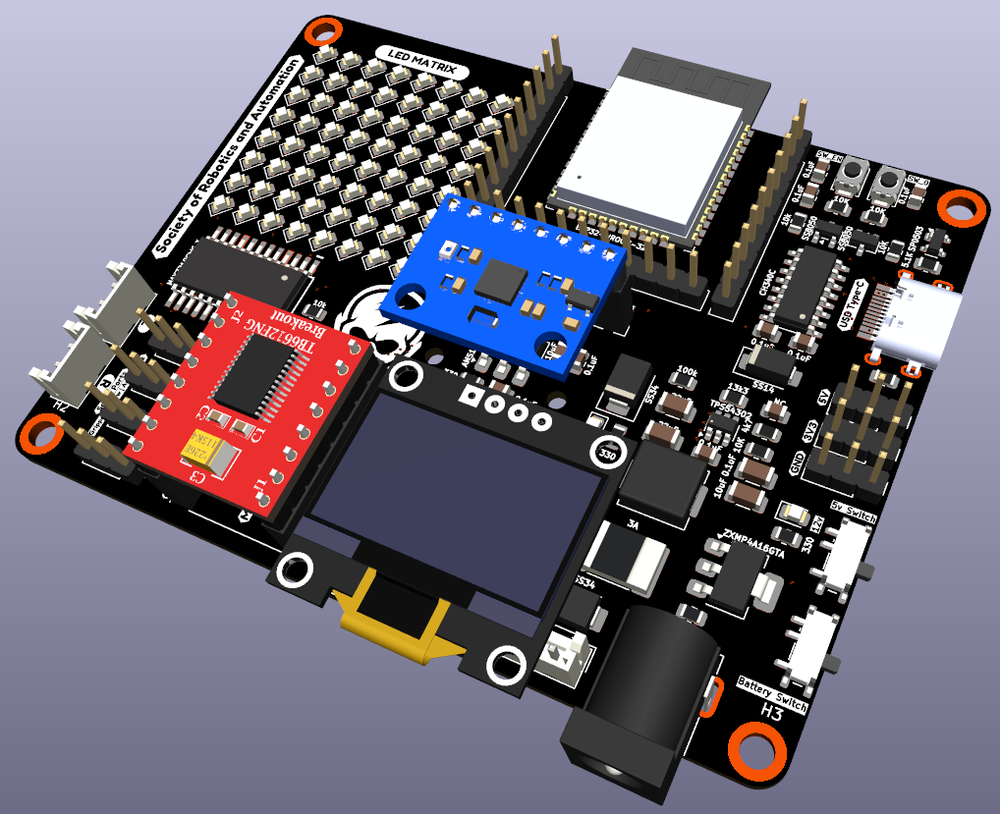
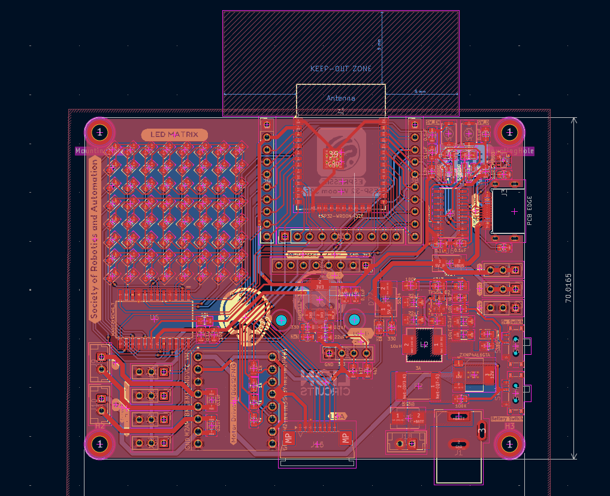

# Wall-E-2027-Board-Design

<!-- PROJECT LOGO -->

[![Stargazers][stars-shield]][stars-url]
[![Forks][forks-shield]][forks-url]
[![Issues][issues-shield]][issues-url]
[![License][license-shield]][license-url]

# SRA Board

The SRA board is a development board based on ESP32 with on-board peripherals like a programmable LED matrix, switches, sensor ports for Line Sensor Array and MPU-6050, protection circuit for over-current and reverse voltage, and motor drivers.

## About the Project

- This development board is used for the [Wall-E](https://github.com/SRA-VJTI/Wall-E) and [MARIO](https://github.com/SRA-VJTI/MARIO) workshops conducted by [SRA](https://github.com/SRA-VJTI).
- Designed using KiCAD.

## Getting Started with a Development Board

In general, every development board has the following basic features:

- ### Power Supply Unit
  - Microcontrollers (MCUs) usually run on 3.3V or 5V logic supply voltage while input to a development board is normally 12V for motor and driving/controlling peripheral devices.
  - So, in order to have a single input source, a _power_ section which inter converts this 12V to standard levels like 5V & 3.3V for MCU and sensors is present.This is achieved using a step-down [buck regulator](https://www.youtube.com/watch?v=m8rK9gU30v4).

- ### Motor Driver
  - Motors usually run on 12V and MCU output is generally 5V/3.3V. So, an external motor driver circuitry is required to control motors according to the MCU input.
  - The SRA board use the [TB6612FNG](./datasheets/TB6612FNG_motor_driver.pdf) Motor Driver, which is a MOS-based H-Bridge motor driver.

- ### Sensor Port
  - According to the external sensor types, usually development boards have onboard sensor ports where the sensors can be connected easily. [LSA - Line Sensor Array]() and [MPU- Motion Processing Unit]() have on-board connection ports.
  - Easily available and efficient [JST XH connectors](https://en.wikipedia.org/wiki/JST_connector).
  - Previous versions used bulky [FRC connectors](<https://www.sunrom.com/c/frc-idc-flat-cable-box-header#:~:text=FRC%20(Flat%20Ribon%20Cable)%20are,from%206%20to%2064%20pins.>)

- ### Protection against [Reverse Voltage](https://www.google.com/url?sa=t&rct=j&q=&esrc=s&source=web&cd=&cad=rja&uact=8&ved=2ahUKEwjc8aaX1c3rAhXXXSsKHXphBgQQFjABegQICxAD&url=https%3A%2F%2Fwww.ti.com%2Flit%2Fpdf%2Fslva139&usg=AOvVaw0Qbub75JJ986MzLv6FYWKE)
  - The SRA Boards use diodes for reverse voltage protection in the power-line.
  - 12V Motor line and power regulated line have been separated with [SS34](./datasheets/ss34_3A_schottky_diode.pdf) and [SS54](./datasheets/ss24_2A_schottky_diode.pdf) schottky diodes respectively.

- ### Protection against [Over Current](https://www.baypower.com/blog/what-is-overcurrent-protection/#:~:text=Overcurrent%20protection%20is%20the%20method,of%20a%20piece%20of%20equipment.)
  - This is done by PTC Resettable Fuses.
- ### Programmable Switches and LEDs
  - Every development board should have some programmable switches and LEDs for testing, control and debugging purposes.
  - The SRA Board features a 8x8 LED matrix (64 LEDs total) controlled via MAX7219, which provides enhanced debugging capabilities and expressive visual feedback while reducing GPIO usage compared to discrete LEDs.

- ### Power Switch
  - All versions have a power switch for the motor driver, using which power supply to the motor driver can be toggled. Similarly, there was a switch for the ESP32 MCU.

- ### **Compatiblity of SRA Board with Battery [3- 3.3V 2500mAh Batteries](https://robu.in/product/bak-nmc-18650-2500mah-8c-lithium-ion-battery/?gad_source=1&gclid=Cj0KCQjw6PGxBhCVARIsAIumnWb20iyJUEXE8V6eAfSambP35PfBsSFKje-ALjyNniqGYCW_kz3IbcQaAoeGEALw_wcB)**
  - The SRA Board is compatible with **3-cell (3S) Lithium-ion battery packs** which use an external **[BMS (Battery Management System)](https://robu.in/product/3s-10a-12v-18650-lithium-battery-charger-board-protection-module/)**.
  - The BMS helps maintain safe operating voltages and disconnects the battery when the voltage drops below a safe limit.
  - It also ensures balanced charging and discharging of the three cells, improving the overall health and lifetime of the battery pack.

- ### **LD33 (3.3V) to [AMS1117](http://www.advanced-monolithic.com/pdf/ams1117.pdf)**:
  - Older editions used the **LD33 IC** to step down from 5V to 3.3V.
  - This was later replaced with the **AMS1117-3.3 LDO**, which is more compact and widely used for stable 3.3V regulation.
  - (_AMS1117 is also used on the ESP32-DevKitC V4 module._)

- ### **Reverse voltage protection: Diodes to P-MOSFET**
  - Diodes placed in series with the power line introduce voltage drop and power loss compared to a **P-MOSFET based protection circuit**.
  - Due to the higher current requirements of the motors, managing diode size and current rating became difficult.
  - Therefore, earlier versions used a **P-MOSFET based reverse polarity protection circuit**, which is more efficient and can handle higher currents.

## Contributors

- [Varun Patil](https://github.com/VarunAPatil): _Designer_
- [Omkar Nanajkar](https://github.com/nomkar24): _Designer_
<!-- ACKNOWLEDGEMENTS AND REFERENCES -->

## License

- Distributed under the [MIT License](https://github.com/SRA-VJTI/sraboard-hardware-design/blob/master/LICENSE).

[forks-shield]: https://img.shields.io/github/forks/SRA-VJTI/sra-board-hardware-design
[forks-url]: https://github.com/SRA-VJTI/sra-board-hardware-design/network/members
[stars-shield]: https://img.shields.io/github/stars/SRA-VJTI/sra-board-hardware-design
[stars-url]: https://github.com/SRA-VJTI/sra-board-hardware-design/stargazers
[issues-shield]: https://img.shields.io/github/issues/SRA-VJTI/sra-board-hardware-design
[issues-url]: https://github.com/SRA-VJTI/sra-board-hardware-design/issues
[license-shield]: https://img.shields.io/github/license/SRA-VJTI/sra-board-hardware-design
[license-url]: https://github.com/SRA-VJTI/sra-board-hardware-design/blob/master/LICENSE